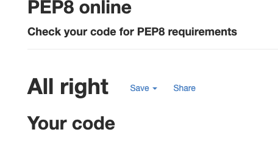
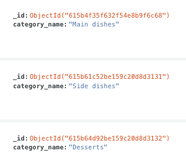
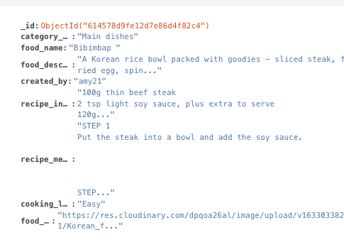
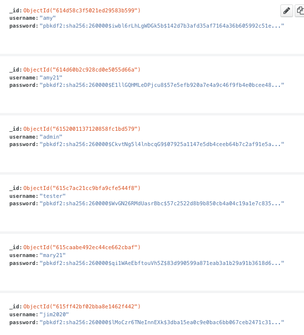

# K-Food recipes

[View the live project here](https://korean-food-recipes.herokuapp.com/) 

This website is mainly create for user who interest about Korean food recipes. Moreover, user can register the website to be able to add new recipe, edit and delete the content too. The main aim of the project is create a user-friendly website can help user to interact with contents and search the information easily about Korean food recipe. User can also interact with other user as user name can be shown on the bottom of content. 

---
---
## Table of contents
---

[Overview](#overview)

[Description](#description) 

[Ux](#ux) 

[Features](#features) 

[Technologies](#technologies) 

[Testing](#testing) 

[Deployment](#deployment) 

[Credits](#credits) 

## Overview
---
There are many websites offers food recipe. Many websites also offer Korean food recipes. However, there not many website users can upload their skill and recipe/tips. Most food recipe websites rely on the owner's data update or users comment section. I want to create a website that can be simple and easy to share users own recipe date.  

## Description
---
It is a Korean food recipes contents sharing website that is intended to be accessible on all devices. My aim in this project was to make the website more interactive. Therefore users can share their own recipes and skill with other users by posting their content. Also, try to make a simple layout to increase a positive user experience.

## UX

### User experience
---

### Strategy
---

 Main target user : Korean food lovers in worldwide/visiter
This website is aimed to engage each user by sharing their own Korean food recipe. the contents can be added, edit and delete and Creator only can create/edit/delete the contents. To be able to do that users need to register and log in with their id and password. Therefore site can be more secure and manageable by user information which will automatically collect on mongoDB database. 

####  Business Goals

 1. To gain an increase in website user interactive

 2. To provide a professional, clear and easy navigate website for any type of user, be it, first time user, as well

 3. Offer users the function to share their content and post on this site to interact with other users. 

 4. User's data and traffic increment can be used further in business models such as Korean food marketing or tools. 

#### User Stories

  * As first time user

    " I'm just looking for an easy way to cook simple Korean food, I don't want to register"

    " I don't want to search too many Korean food recipes. I'm just looking for Korean dessert"
    
    " I got my own Korean food recipe, I love to share with others"

        

  * As Regular User:

    "I want to change my recipe, I find a better way to cook"

    " I don't want others can edit my contents"

    " I don't interest any other contents apart from Korean food recipe, want to simply share my share mine and learn from others. wish I could leave the comment though"

### Scope
---

 - Useful - This website is useful to a user who searches Korean food recipes and shares their own skills as well.

 - Sellable - There are many potential fundable possibilities such as a Korean food marketing research purpose and advertisement.

 - Buildable - Fits in with the level of my abilities, limited python usability and javascript function but it can improve in future.

 - Objective - search for best suitable Koran food recipes and posting own skill with function. 

 - Functional - user can log in/log out and register an account. After register the website, the user can update new recipes and edit, delete contents. 

 - Non-Functional  -  limited contents engaging function. if the user can leave a comment on the other user's content would be better. Also, more documents for cooking time and portion size can be add in future. 

 - Business Rules -  The Korean food recipe is very subjective and coming from an individual's experience. However, make sure the user doesn't share non-related information. Always develop the function to gain users' feedback.

 * Main target user : Koran food lovers/chef/food experts/ visiter

### Structure
---
There are three pages for the non-registered user. 
The home page/login/register. The home page come with introducing the website with modal function as "about this site". When the user clicks the button it is pop-out the introduction of the website. And it also contains a search bar and images with recipes. under the containers, there is pagination, so the user can be sure it is just one page. 
login and register page leads the user can log in or register the site. 
If the user is already registered and login with a username, there are two more pages that will be shown such as new recipe add and profile pages. The profile page will be automatically linked once the user logs in. and the user can add a new recipe and the edit/delete button also shows if the contents were created by the creator. 

### Skeleton
---
The website shows two different ways. the non-registered user used the site and the registered user using the site. Most of the pages are match with my framework, but I didn't count on the sidebar which will show when users use a small device such as mobile phones or small tablets. I change the title from Korean food recipe to K-food recipe later and few small details have been changed after. 

 
 #### Wireframes

 - Landing Page: welcoming page
 

 - login

 - Register

 - profile
 

 - newrecipe

 

### Surface
—--

I wanted to have a bright and energetic concept on my site. There are common concepts about Korean food is very spicy. So I chose the main colour as red and I give different light dept of red colour. Most of the colour tones got inspired by Materialize color palette [Materialize color palette](https://materializecss.com/color.html) Check [colorspace]((https://mycolor.space/?hex=%23352E24&sub=1)) for colour match. logo image work on myself to match the colour tone with the website. Most of the containers and images got border shadows to look more 3D visual effect.

 #### Design

   - Images :Each food image is selected from the Korean food photo section mainly from [pixabay](https://pixabay.com/). All the photos and recipes are matched with each other and I want to make sure to choose more variety Korean food categories such as the main dish, side dish and dessert. 

  - Color Scheme :  mainly use red to symbolise the spicy Koran food concept. Try to change the red color light with a button .Only edit and delete button use green and blue to easily recognise. 
 

   
    

  - Typography : I used Google Fonts to get some idea of my website fonts and decided to use “ ‘Poppins” and “Sans-serif” as the backup font. I choose Poppins because it looks more followed trend as modern and minimalism at the same time it looks friendly and reliable.

  - Icons : Font Awesome was my choice to use all icons on my website. Try to use icons that easy to understand the purpose of usage. 

## Features
---

### Navbar

 - There is a navbar fixed on the top of all the web pages to give the user better access and navigate the website easily. 

 - logo image and logo title linked to home and on a mobile or tablet, the navbar is then collapsed to show the hamburger icon which expands as a left sidebar. 

 - when the user login the account, new pages(new recipe and profile) add from the basic navbar. 

### Home

 - Top of Home has about modal button to introduce the website

 - Search too on the top of all the recipes can search by text

 - food image with recipes contents with Card reveals function. So the user clicks the food title it will reveal more information. there is a close function included. Also, Delate and Edit button include in case the creator want to edit the contents. 

 - pagination function is bottom of the page to make sure the user can aware that how long the contents it is. It could be spited up in future. 

### Login

 - simple login function page with a user name and password input form.  Under the form, the link suggested to the register page to lead the user to register to the site. User name and password min 5 to max 15words. required and correctly labelled.

### Logout

 - when the user logout the page it is automatically link to login page

### New Recipes

 - the form included food category/food name/cooking level/food description/food image/ingredients/method. The user can add a new recipe to this page and all the sections are required to update data

### Profile

 - the profile page is automatically linked to login information. So, registered user login the site, profile page open with right user information and it also has a button with home page linked. 

### Register

 -  simple register function page with a user name and password input form.  Under the form, the link suggested to the login page to lead the user who already register to the site. User name and password min 5 to max 15words. required and correctly labelled.

## Features left to implement
---

 -  The user comment section can be useful. It will increase interaction between users. 

 -  Social media links can be added in future such as facebook page or instagram. It will also be a nice tool to collect information and engagement between users. 

 - Would be nice add page about Korean food cooking tools and other section related Korea food culture.  

 

## Technologies

### Technologies Used
---

### Languages Used

## HTML5, CSS3, JAVASCRIPT,Python+Flask,MongoDB

### Frameworks,Libraries & Service sites

1) [materialize](https://materializecss.com/) - Primary front-end framework

2) [mongoDB](https://www.mongodb.com/) - MongoDB is a document-based database. It used manage to database connect with my gitpot repository.

3) [Google Fonts](https://fonts.google.com/specimen/Oswald?preview.text_type=custom) - Google fonts use for most headlines and paragraphs. 

4) [Font Awesome](https://fontawesome.com/) - It used on all pages throughout the website to add icons 

5) [Balsamiq](https://balsamiq.com/wireframes/) - used to create the wireframe during the design process.

6) [JQuery](https://jquery.com/) - used javascript fuctions.

7) [flask](https://flask.palletsprojects.com/en/2.0.x/) - The project uses Flask, which is a Python microframework.

8) [Jinja](https://jinja.palletsprojects.com/en/2.11.x/) - The project uses Jinja for templating with Flask in the HTML code. I used Jinja to simplify my HTML code, avoid repetition, and allow simpler linking of the back-end to the front-end.

9) PyMongo - The project uses PyMongo as the Python API for MongoDB. This API enables linking the data from the back-end database to the front-end app.

10) [cloudinary](https://cloudinary.com/) - used to upload media files and get the URL address. This URL address used to upload image on mongoDB/ app food image. 

### Version control

  - [Github](https://github.com/) - Used to store the code and use of Github Pages to deploy the website.

  - [Gitpod](https://gitpod.io/workspaces) - Used as the primary version control IDE for developers to further push and commit code to Github.

### Hosting
  - [Heroku](https://www.heroku.com/) - I've used Heroku as the hosting platform to deploy my app.

### Other

 - [Code institute Course](https://learn.codeinstitute.net/ci_program/diplomainsoftwaredevelopment) - my primary source of leaning code.
 - [ChromeDevTools](https://developer.chrome.com/docs/devtools/)- Used eachtime when I check error/issue on my site.
 - [W3Schools](https://www.w3schools.com/js/default.asp) - often use for css and javascript code tips
 - [AmIResponsive](http://ami.responsivedesign.is/) - Used to check how the layout of the website looks across different devices.
 - [responsinator](http://www.responsinator.com/?url=https://oneday2010.github.io/milestone-project2/) - Used to test website layout on multiple devices
 - [Google Mobile Friendly Test](https://search.google.com/test/mobile-friendly) - Used to test all pages on a mobile device
 - [Colorspace](https://mycolor.space/?hex=%23352E24&sub=1) - Used to find right color pattern for my website
 - [Youtube](https://www.youtube.com/) - Used to got javascript and css tip
 - [TinyJPG](https://tinyjpg.com/) - to compress image to better loading speed 
 

## Testing 
---

 - Forms testing

  * There are five test users registered in this site. 
    
    - username : Amy21 - password : test2021 ( 9 recipes updated by this username)
    - username : Admin - password : admintest ( 6 recips updated by this user name)
    - username : Tester - password : test2021
    - username : Mary21 - password : marytest
    - username : Jim2020 - password : jimtest

-> login with Amy21 or Admin, site shows edit/delete button. 

There are six form tests images below. 

1.  login 

 - a user who already registers an account on this website can log in with an input username and password. If the username is less than five letters or more than 15letters, it shows a red underline and warning message with "please match the format requested". Same warning with a password. If password or username does not match with data, flask message pop up right corner of the website with a warning message. Moreover, after login, user's profile page will be open and with messege with username on it. 
  

2. register

 

 - when a user tries to register an account, the user needs to input a username and password which letters between five to fifteen. If the requirement doesn't match, it will show a warning message.  After register  success, the user will be lead to the profile page and get the flask message with 'Registration Successful!"

3. add recipe 

 

 - After the user adds a new recipe on the new recipe page, the pop-up message shows with the user successfully add the recipe. and if the contents don't match with the requirement, it doesn't allow to add any data. 

4. edit recipe

 

 - There are clickable buttons under recipes if the contents are created by the user who login. Therefore creators can edit/delete the contents as they wish. if the user clicks the edit button, it will lead to original data filled in a form and the user can change. After changing the form, the user can click the edit recipes button or cancel. If click edit recipes it updates with new data and if click the cancel will lead to the home page.

5. delate recipe

 

 - if the user clicks the delete button, it will delete the food recipe, the user will see the pop-up message.
 

6. logout

  - If the user clicks the logout on the navbar it will lead the user to the login page and the user will get a pop-up message.

# Links : 

 Testing across various devices ( I used [responsinator](http://www.responsinator.com/?url=https%3A%2F%2Fkorean-food-recipes.herokuapp.com%2F) as well as my one device and friends. the devices blow works without issue

  -  Mobiles/tablet/laptop()

   * iPhone eXpensive portrait · width: 375px                 
   *  Android (Pixel 2) portrait · width: 412px
   * Android (Pixel 2) landscape · width: 684px
   * iPhone 6-8 Plump portrait · width: 414px
   * iPhone 11
   * iPad portrait · width: 768px:
   * MacBook 13inch 2014
   * MacBOOK 13inch 2019

 - Ensured the website was also responsive on all the pages [Google Mobile Friendly Test](https://search.google.com/test/mobile-friendly?utm_source=gws&utm_medium=onebox&utm_campaign=suit) 

   - Home 

   - login 

   - register 

   - addrecipe  

   
  - I tested on Safari,Chrome, Firefox it was performed without issue. 

#### Validation

 - [W3C Markup Validator](https://validator.w3.org/) : The W3C Validator tool doesn't recognise the Jinja templating, which has resulted in showing a lot of errors in relation to the Jinja code. However, all other code is validating fine.

 - [W3C CSS Vaildator](https://jigsaw.w3.org/css-validator/) 

    All pages have no issue found. same comments such as  blows image with all the pages

    

 - [Esprima Syntax Validator tool](https://esprima.org/demo/validate.html) 

    All pages have no issue found.

    

 - [Pep8 Online tool](http://pep8online.com/) 

    No issues found.

   

 #### Project bug and solution

  - bug1

   

   This bug happened when the app was running and I use an image directory with  (img src="static/images/k_food_logo.png"), It works fine on other pages but only the profile page didn't work. So I used  url_for() method
   (img src="{{ url_for('static', filename='images/k_food_logo.png') }}")
    and it worked all the app without issue. 

  - bug2

  Python code validator found three issues

  trailing whitespace/no newline at end of files python/line too long.
I fixed tide up the code and add a blank line end of the file as well as cut off the long line. fixed the issue eventually. 

 - bug3
 
  There is an issue with the search function tool. It doesn't search properly and only searches properly when the food name is input collected on the search form. I tried to add another index on mongoDB and try to change the code on python, it doesn't recognise the index. Need to improve in future. 

 
  
### Testing User Stories from User Experience (UX) section

 #### Testing user story goal

  * ##### As as First Time User:

            

## Deployment
---

 ### Local Deployment

  1) in order to run this project locally on your own system, you will need the following installed:

  - Python3 to run the application.
  - PIP to install all app requirements.
  - MongoDB to develop your own database either locally or remotely on MongoDB Atlas. There's a series of steps to take in order to proceed with local deployment:

    Make sure you got your database access (Username and URL as well as password)in MongoDB. when all got set, you need to connect with the Mongo DB Shell and your gitpod repository. CRUD(create, read, update, and delete) need to be work through the step.
     
      
I got three collections ( categories,foods,users). each collection can be add extra document and each document got an unique id. 

  categories 
  
  

  foods 
  
  

  users 
  
  

   2)  You should now be able to run the app locally using the python3 app.py command.

   3) The app should now be running on localhost on an address similar to http://127.0.0.1:5000. Simply copy/paste this into the browser of your choice!

   4) there is some sensitive data which we need to be hide in file "env.py" and it is able to hide file ".gitignore" there for you can secure your confidential data. you need to setup a secret key, which is required whenever using the flash() and session() functions of Flask from MongoDB. 
        

   

### Remote Deployment  

  This site is currently deployed on Heroku using the main branch on GitHub. To implement this project on Heroku, the following steps were taken:

  1) Create a requirements.txt file so Heroku can install the required dependencies to run the app.
  "pip3 freeze --local > requirements.txt".

  2) Create a Procfile to tell Heroku what type of application is being deployed, and how to run it.
    echo web: python app.py > Procfile

  3) Sign up for a free Heroku account, create your project app, and click the Deploy tab, at which point you can Connect GitHub as the Deployment Method, and select Enable Automatic Deployment.
  
  4) In the Heroku Settings tab, click on the Reveal Config Vars button to configure environmental variables as follows:
  IP : 0.0.0.0
  PORT : 5000
  MONGO_URI : <link to your Mongo DB>
  SECRET_KEY : <your own secret key>

  Back to diploy section and try diploy your app.
  Your app should be successfully deployed to Heroku at this point.

## Credits
---
* ### Content

    1) Many python code got inspired from  [codeinstitute_miniproject_task manager app ](https://learn.codeinstitute.net/courses/course-v1:CodeInstitute+DCP101+2017_T3/courseware/9e2f12f5584e48acb3c29e9b0d7cc4fe/0d4e3419132440d9b2c0943f80dc54a8/)

    2) Primary front-end framework from [materialize](https://materializecss.com/)

    3) Korean food recipe and containes [BBCGOODFOOD](https://www.bbcgoodfood.com/) / [maangchi](https://www.maangchi.com/)
    
    4) Grammar and spelling checked from [Grammarly](www.grammarly.com/)
    

* ### Media

  most of images I used I referenced below (Pixabay) and else below

    1) logo created by myself I used this tool [canva](https://www.canva.com/)
    2) [Bibimbap](https://pixabay.com/photos/food-photography-korean-bibimbap-2610863/)
    3) [Korean fied chicken](https://pixabay.com/photos/chicken-korean-dish-food-fry-521097/)
    4) [Fried rice](https://pixabay.com/photos/kimchi-fried-rice-fried-rice-rice-241051/)
    5) [Kimchi](https://pixabay.com/photos/kimchi-korean-food-food-korea-4361465/)
    6) [sonpun](https://pixabay.com/photos/wind-pant-tteok-rice-cake-masu-4869955/)
    7) [Yakgwa](https://pixabay.com/photos/korean-traditional-sweets-drug-and-2150895/)
    8) [Teokbokki](https://pixabay.com/photos/tteokbokki-food-korean-food-1607479/)
    9) [bulgogi](https://pixabay.com/photos/ttukbaegi-bul-gogi-ttukbaegi-bulgogi-2517765/)
    10) [bbq wing](https://pixabay.com/photos/ttukbaegi-bul-gogi-ttukbaegi-bulgogi-2517765/)
    11) [spinach_side](https://pixabay.com/photos/spinach-side-dish-vegetable-552505/)
    12) [Jap Chae noodles](https://pixabay.com/photos/japchae-asian-food-vegetables-house-876506/ )
    13) [Porkmeat fired](https://pixabay.com/photos/pork-meat-fried-korean-food-dinner-1582916/)
    14) [Stir-fried oyster mushrooms](https://pixabay.com/photos/food-cooking-mushrooms-4564419/)
    15) [hotdog](https://pixabay.com/photos/food-snack-street-food-korean-food-4701098/)
    16) [Hotteok](https://pixabay.com/photos/street-food-food-dish-snack-meal-6226730/)
    17) [kimbop](https://pixabay.com/photos/food-photography-korean-kimbab-2610864/)

* ### Acknowledgements

    I received inspiration for this project from 

    1) [Code institute](https://learn.codeinstitute.net/ci_program/diplomainsoftwaredevelopment)

    2) I got great help from elerel's [readme reference](https://github.com/elerel/ms1-go2snow/blob/master/README.md#overview) and pramcistudent'[readme reference](https://github.com/pramcistudent/cookbook-project3/blob/master/README.md#local-deployment)

    3) My mentor Nishant Kumar's support gives me great help and Thanks to my tutors. 