# K-Food recipes

[View the live project here](https://korean-food-recipes.herokuapp.com/) 

---
---
## Table of contents
---

[Overview](#overview)

[Description](#description) 

[Ux](#ux) 

[Features](#features) 

[Technologies](#technologies) 

[Testing](#testing) 

[Deployment](#deployment) 

[Credits](#credits) 

## Overview
---

## Description
---

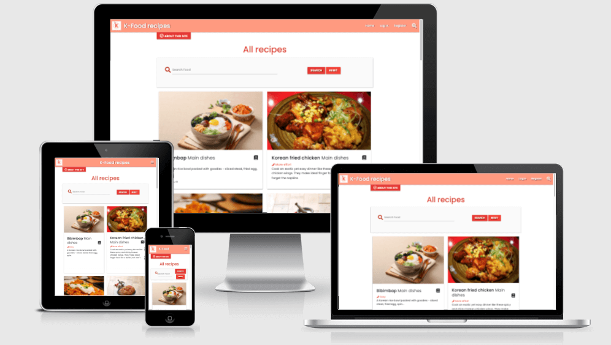

## UX

### User experience
---

### Strategy
---

 Main target user : 

####  Business Goals

 1. 
 2. 

 3. 

 4. 

#### User Stories

   * As first time user

      

  * As Regular User:

    

### Scope
---

 - Useful - 

 - Sellable - 

 - Buildable - 

 - Objective - 

 - Functional - 

 - Non-Functional  - 

 - Business Rules - 

 * Main target user : 

### Structure
---

### Skeleton
---

 
 #### Wireframes

 - Landing Page: welcoming page
 
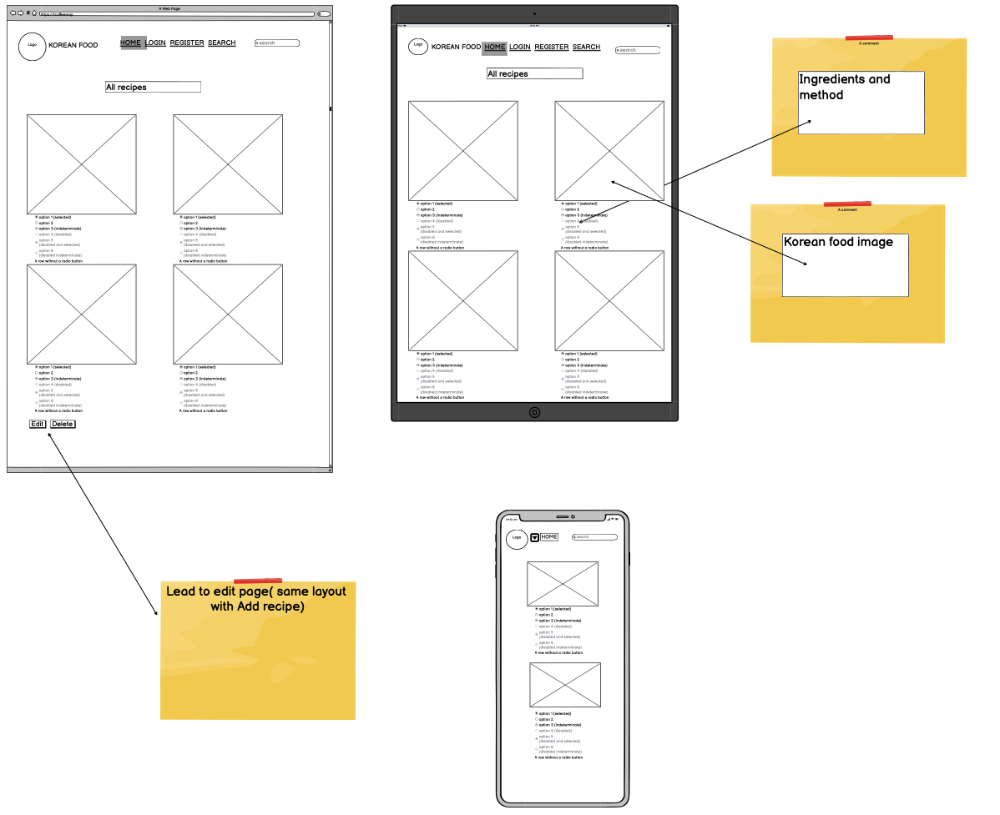

 - login

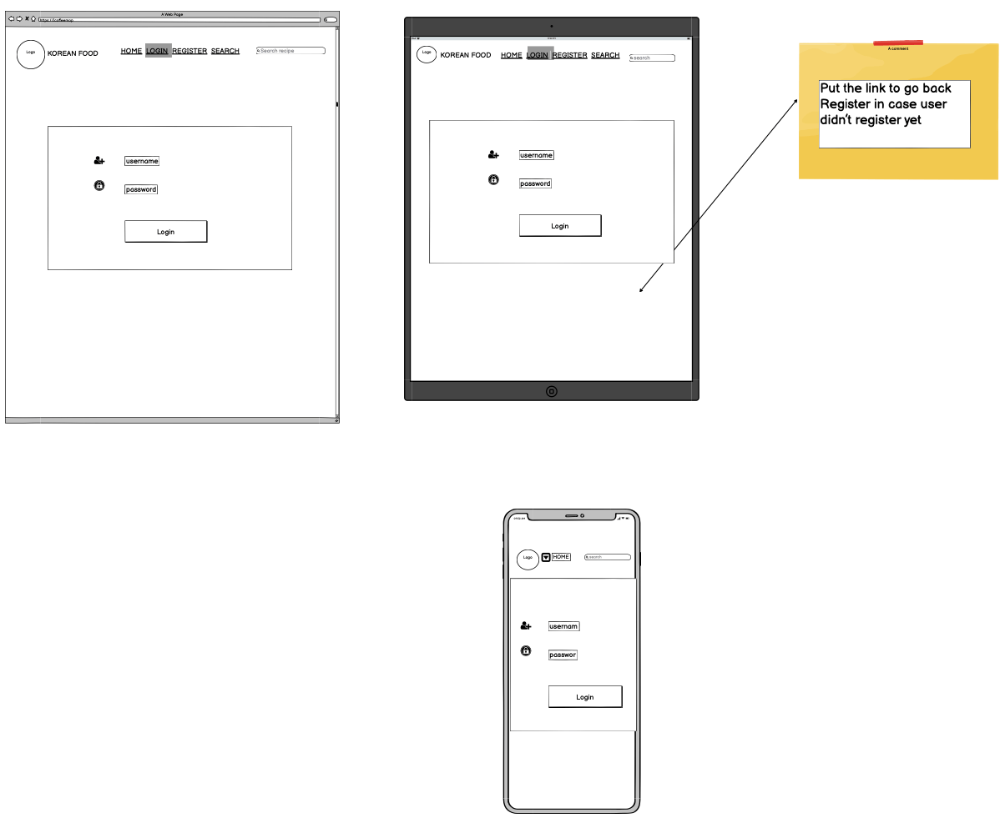

 - 

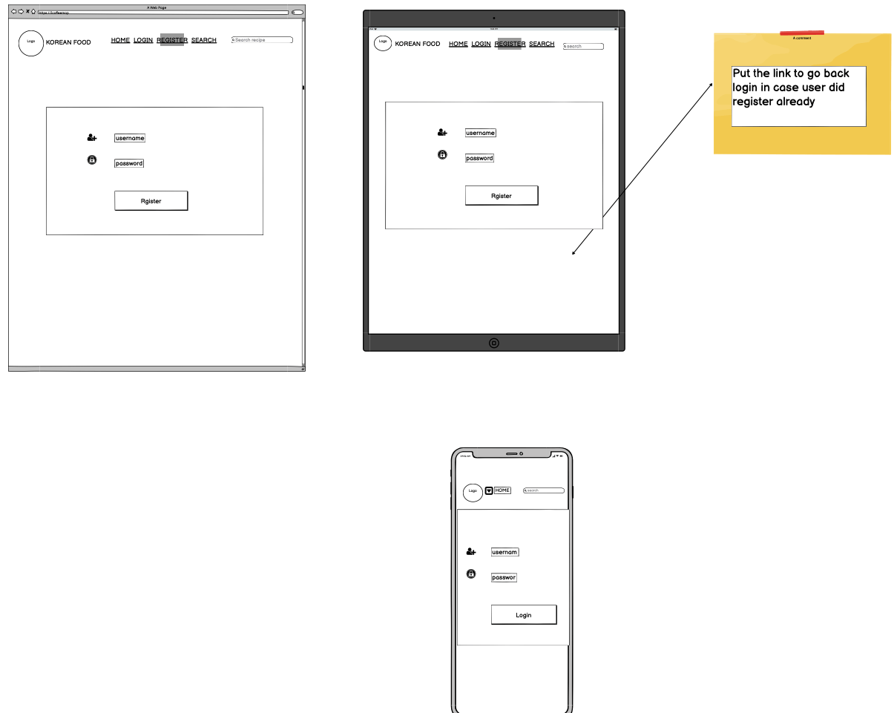

 - 
 
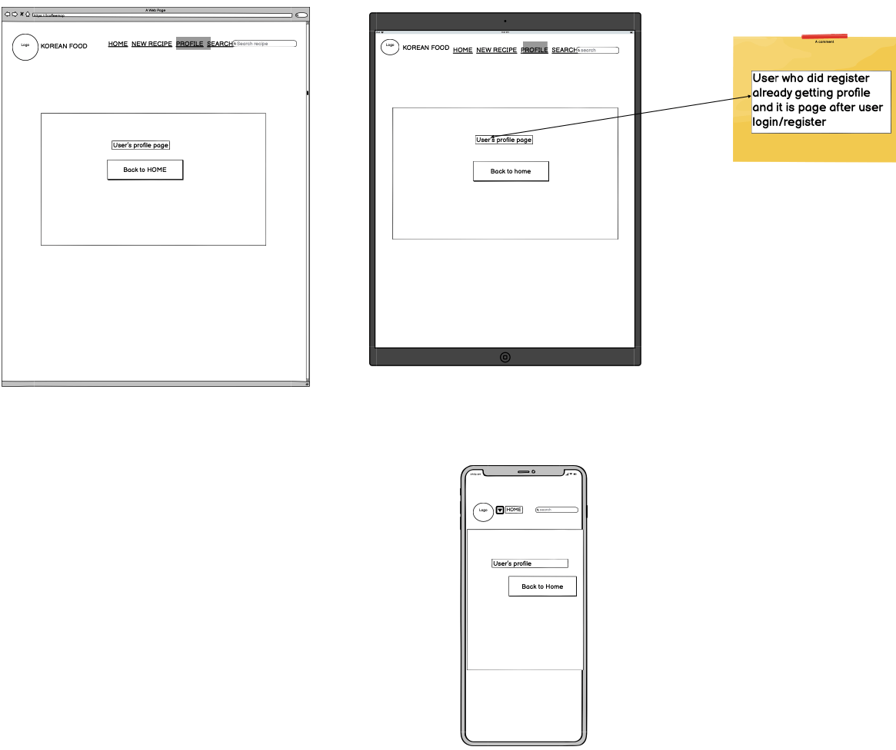

 - 

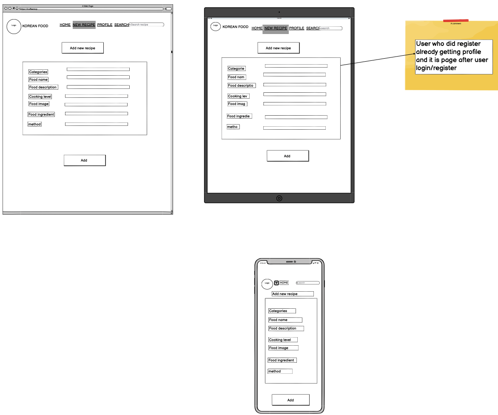

 - 

### Surface
—--

 #### Design

   - Images :

  - Color Scheme : 

 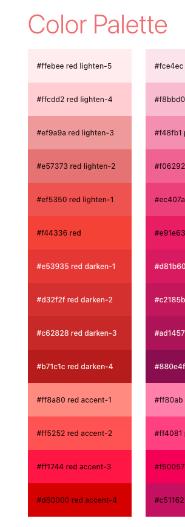
    -- 

  - Typography : Typography : I used Google Fonts to get some idea of my website fonts and decided to use “ ‘Poppins” and “Sans-serif” as the backup font. I choose Poppins because it looks more followed trend as modern and minimalism at the same time it looks friendly and reliable.

  - Icons :Icons : Font Awesome was my choice to use all icons on my website. I used mainly footer social icon, top3 page heading icons. Try to use icons that easy to understand the purpose of usage.

## Features
---

### Navbar

 -  

 - 

 - 

### Home

 - 

 - 
 - 

 - 
### Login

 - 
### Logout

 - 

### New Recipes

 - 

### Profile

 - 

### Register

 - 

## Existing Features
---

### HOME

### Login

### Logout

### New Recipes

 

### Profile

 

### Register

## Features left to implement
---

 - 

 - 

 - 

 

## Technologies

### Technologies Used
---

### Languages Used

## HTML5, CSS3, JAVASCRIPT,Python+Flask,MongoDB

### Frameworks,Libraries & Service sites

1) [materialize](https://materializecss.com/) -

2) [mongoDB](https://www.mongodb.com/) - 

3) [Google Fonts](https://fonts.google.com/specimen/Oswald?preview.text_type=custom) - Google fonts use for most headlines and paragraphs. 

4) [Font Awesome](https://fontawesome.com/) - Use bootstrap4/font-awesome version. It used on all pages throughout the website to add icons 

5) [Balsamiq](https://balsamiq.com/wireframes/) - used to create the wireframe during the design process.

6) [JQuery](https://jquery.com/) - used javascript fuctions)

7) [flask](https://flask.palletsprojects.com/en/2.0.x/) - The project uses Flask, which is a Python microframework.

8) [Jinja](https://jinja.palletsprojects.com/en/2.11.x/) - The project uses Jinja for templating with Flask in the HTML code. I used Jinja to simplify my HTML code, avoid repetition, and allow simpler linking of the back-end to the front-end.

9) PyMongo - The project uses PyMongo as the Python API for MongoDB. This API enables linking the data from the back-end database to the front-end app.

### Version control

  - [Github](https://github.com/) - Used to store the code and use of Github Pages to deploy the website.

  - [Gitpod](https://gitpod.io/workspaces) - Used as the primary version control IDE for developers to further push and commit code to Github.

### Hosting
  - [Heroku](https://www.heroku.com/)b - I've used Heroku as the hosting platform to deploy my app.

### Other

 - [Code institute Course](https://learn.codeinstitute.net/ci_program/diplomainsoftwaredevelopment) - my primary source of leaning code.
 - [ChromeDevTools](https://developer.chrome.com/docs/devtools/)- Used eachtime when I check error/issue on my site.
 - [W3Schools](https://www.w3schools.com/js/default.asp) - often use for css and javascript code tips
 - [AmIResponsive](http://ami.responsivedesign.is/) - Used to check how the layout of the website looks across different devices.
 - [responsinator](http://www.responsinator.com/?url=https://oneday2010.github.io/milestone-project2/) - Used to test website layout on multiple devices
 - [Google Mobile Friendly Test](https://search.google.com/test/mobile-friendly) - Used to test all pages on a mobile device
 - [Colorspace](https://mycolor.space/?hex=%23352E24&sub=1) - Used to find right color pattern for my website
 - [Youtube](https://www.youtube.com/) - Used to got javascript and css tip
 - [TinyJPG](https://tinyjpg.com/) - to compress image to better loading speed 
 

## Testing 
---

 - 
 

1. 

    

2. 

 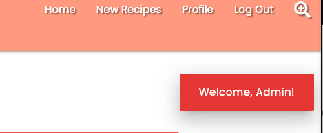

 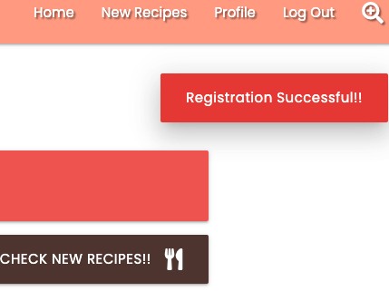

 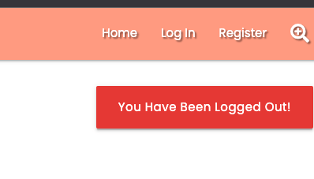

 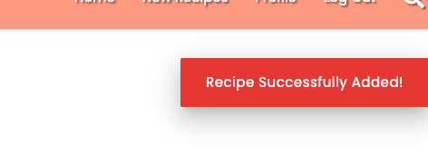

 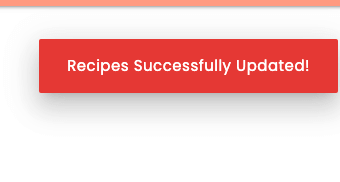

 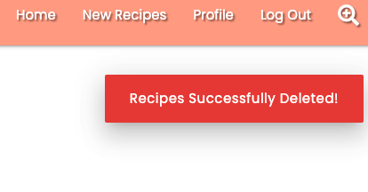
 

3. 

4. 

 

 - Links : 
 Testing across various devices ( I used [responsinator](http://www.responsinator.com/?url=https%3A%2F%2Fkorean-food-recipes.herokuapp.com%2F) as well as my one device and friends. the devices blow works without issue

 - Mobiles/tablet/laptop()
   * iPhone eXpensive portrait · width: 375px                 
   *  Android (Pixel 2) portrait · width: 412px
   * Android (Pixel 2) landscape · width: 684px
   * iPhone 6-8 Plump portrait · width: 414px
   * iPhone 11
   * iPad portrait · width: 768px:
   * MacBook 13inch 2014
   * MacBOOK 13inch 2019

 - Ensured the website was also responsive on all the pages [Google Mobile Friendly Test](https://search.google.com/test/mobile-friendly?utm_source=gws&utm_medium=onebox&utm_campaign=suit) 

   - Home 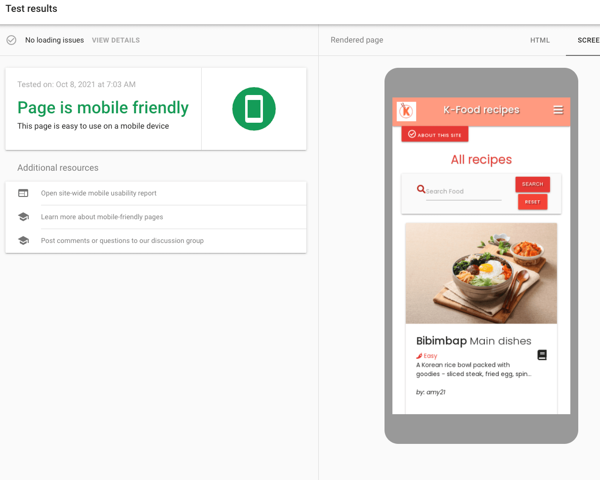

   - login 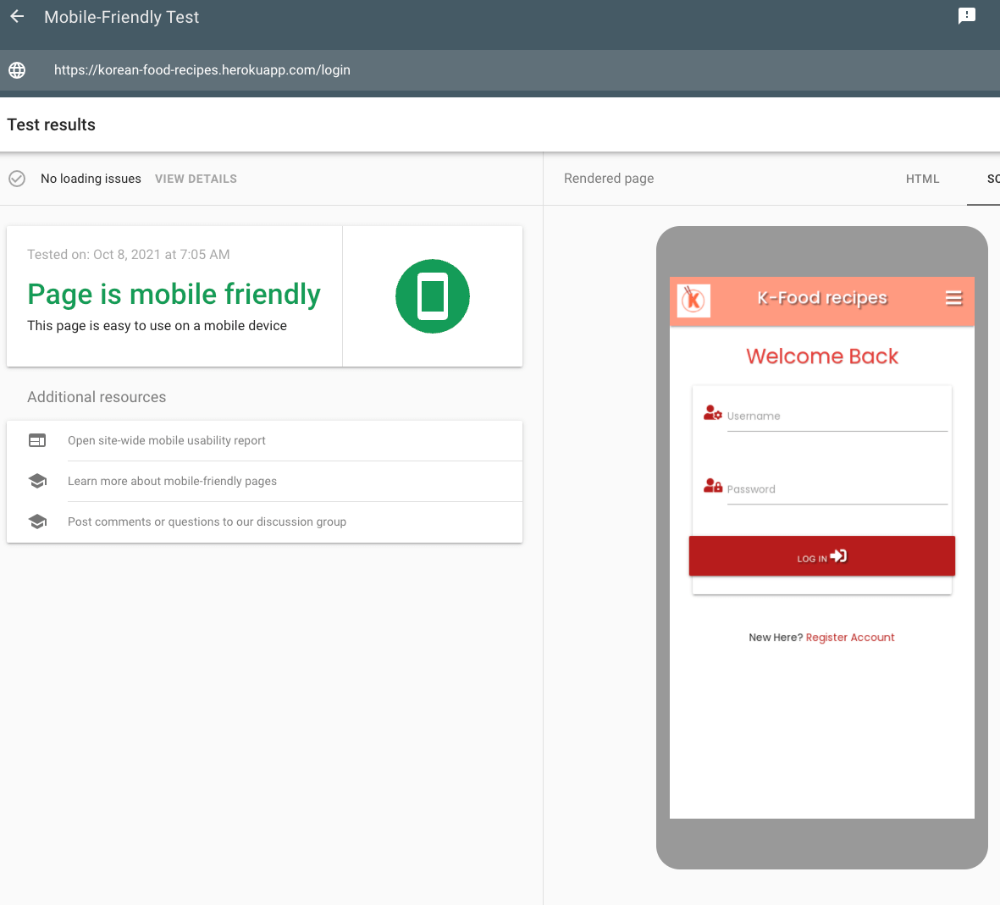

   - register 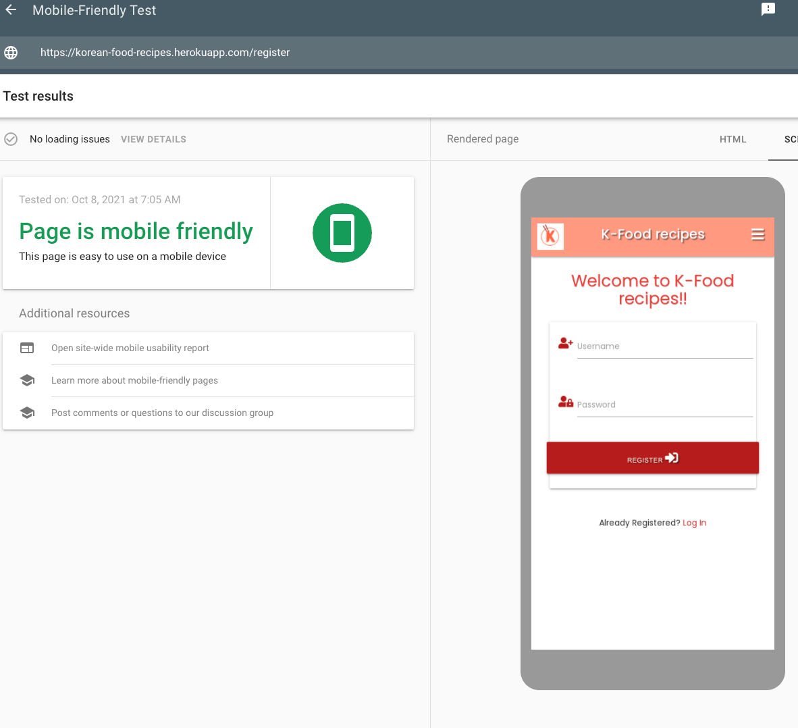

   - addrecipe  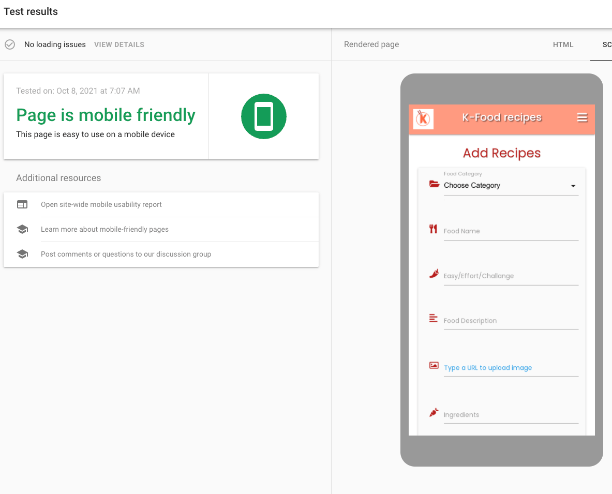

   
  - I tested on Safari,Chrome, Firefox it was performed without issue. 

 #### Validation
 - [W3C Markup Validator](https://validator.w3.org/) : The W3C Validator tool doesn't recognise the Jinja templating, which has resulted in showing a lot of errors in relation to the Jinja code. However, all other code is validating fine.

 - [W3C CSS Vaildator](https://jigsaw.w3.org/css-validator/) 

  All pages have no issue found. same comments such as  blows image with all the pages

 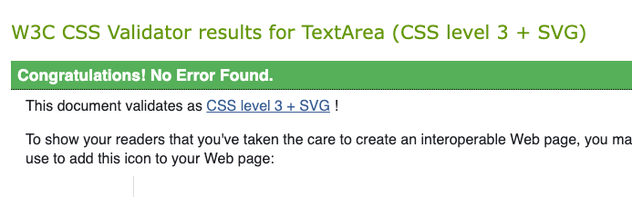

 - [Esprima Syntax Validator tool](https://esprima.org/demo/validate.html) 

  All pages have no issue found.
 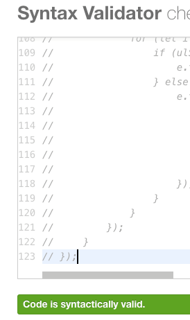

 - [Pep8 Online tool](http://pep8online.com/) 

  
 

#### Project bug and solution

  - bug1

          T

  - bug2
  

 
  
### Testing User Stories from User Experience (UX) section

 #### Testing user story goal

  * ##### As as First Time User:

            

## Deployment
---
    1) in order to run this project locally on your own system, you will need the following installed:

      - Python3 to run the application.
      - PIP to install all app requirements.
      - GIT for cloning and version control.
      - MongoDB to develop your own database either locally or remotely on MongoDB Atlas. Next, there's a series of steps to take in order to proceed with local deployment:

    2)  

    3)  

    4) 

    5) 

## Credits
---
* ### Content

    1) Many python code got inspired from  [codeinstitute_miniproject_task manager app ](https://learn.codeinstitute.net/courses/course-v1:CodeInstitute+DCP101+2017_T3/courseware/9e2f12f5584e48acb3c29e9b0d7cc4fe/0d4e3419132440d9b2c0943f80dc54a8/)

    2) Primary front-end framework from [materialize](https://materializecss.com/)

    3) Korean food recipe and containes[BBCGOODFOOD]((https://www.bbcgoodfood.com/)/[maangchi](https://www.maangchi.com/)
    
    4) Grammar and spelling checked from [Grammarly](www.grammarly.com/)
    

* ### Media

  most of images I used I referenced below (Pixabay) and else below

    1) logo created by myself I used this tool [logo](https://www.canva.com/)
    2) [Bibimbap](https://pixabay.com/photos/food-photography-korean-bibimbap-2610863/)
    3) [Korean fied chicken](https://pixabay.com/photos/chicken-korean-dish-food-fry-521097/)
    4) [Fried rice](https://pixabay.com/photos/kimchi-fried-rice-fried-rice-rice-241051/)
    5) [Kimchi](https://pixabay.com/photos/kimchi-korean-food-food-korea-4361465/)
    6) [sonpun](https://pixabay.com/photos/wind-pant-tteok-rice-cake-masu-4869955/)
    7) [Yakgwa](https://pixabay.com/photos/korean-traditional-sweets-drug-and-2150895/)
    8) [Teokbokki](https://pixabay.com/photos/tteokbokki-food-korean-food-1607479/)
    9) [bulgogi](https://pixabay.com/photos/ttukbaegi-bul-gogi-ttukbaegi-bulgogi-2517765/)
    10) [bbq wing](https://pixabay.com/photos/ttukbaegi-bul-gogi-ttukbaegi-bulgogi-2517765/)
    11) [spinach_side](https://pixabay.com/photos/spinach-side-dish-vegetable-552505/)
    12) [Jap Chae noodles](https://pixabay.com/photos/japchae-asian-food-vegetables-house-876506/ )
    13) [Porkmeat fired](https://pixabay.com/photos/pork-meat-fried-korean-food-dinner-1582916/)
    14) [Stir-fried oyster mushrooms](https://pixabay.com/photos/food-cooking-mushrooms-4564419/)
    15) [hotdog](https://pixabay.com/photos/food-snack-street-food-korean-food-4701098/)
    16) [Hotteok](https://pixabay.com/photos/street-food-food-dish-snack-meal-6226730/)
    17) [kimbop](https://pixabay.com/photos/food-photography-korean-kimbab-2610864/)

* ### Acknowledgements

    I received inspiration for this project from 

    1) [Code institute](https://learn.codeinstitute.net/ci_program/diplomainsoftwaredevelopment)

    2) I got great help from elerel's [readme reference](https://github.com/elerel/ms1-go2snow/blob/master/README.md#overview) and pramcistudent'[readme reference](https://github.com/pramcistudent/cookbook-project3/blob/master/README.md#local-deployment)

    3) My mentor Nishant Kumar's support gives me great help and Thanks to my tutors. 